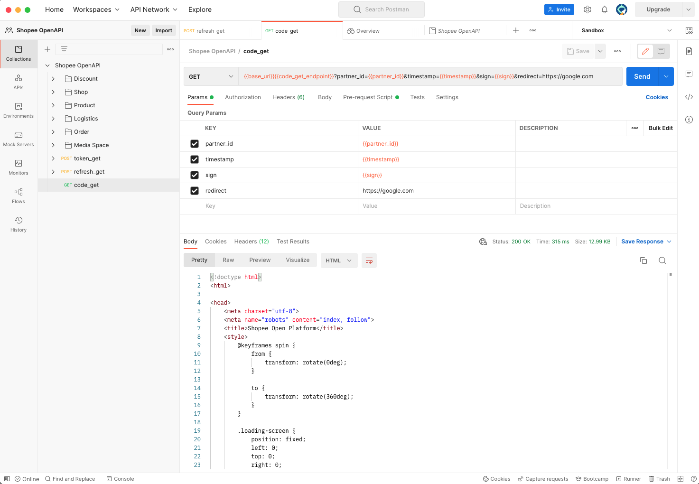

# Shopee Open API Postman Collection
This collection is inteded to help Users from Shopee Open Platform to help them to speed up the process of OpenAPI implementation in their workflows. From main

## Links

- [Main Repository](https://github.com/Decency6748/ShopeeOpenAPIPostmanCollection "ShopeeOpenAPIPostmanCollection Repo")

- [Bugs / Issues](https://github.com/Decency6748/ShopeeOpenAPIPostmanCollection/issues "Issues Page")

- [OpenPlatform Main Documentation](https://open.shopee.com/documents/v2/OpenAPI%202.0%20Overview?module=87&type=2 "Open Platform Documentation")

## Screenshots

## How to get started

1. Clone this repository using command:  
`git clone https://github.com/Decency6748/ShopeeOpenAPIPostmanCollection.git`  
or download zip file
2. Import from `/collections/` folder all content into Postman
3. Modify variables depending of the environment you will be using:

| Environment | Partner ID | Shop ID | Partner Key |
| :----------- | :------------: | :------------ | :------------ |
| Sandbox  |   From Test Partner ID created by the app under development   |    Created in Open Platform Console at Tools > Test Account  |     Provided within the app created in App Management > App List in Open Platform Console | 
| Production     |    Provided after app goes to production    |      ShopId of the store that will be integrated |    Provided after app goes to production | 

## Author

**Luis Rodriguez Marenco**

- [Profile](https://github.com/Decency6748 "Luis Rodriguez")
- [Email](mailto:luis.rodriguez@shopee.com?subject=OpenAPI "Open API Postman Collection")

